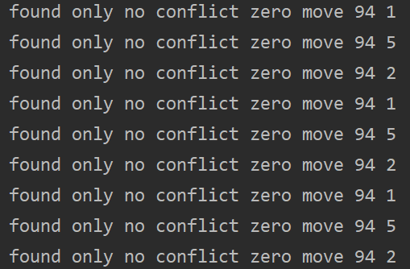
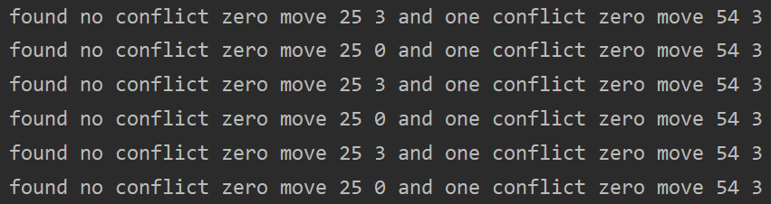
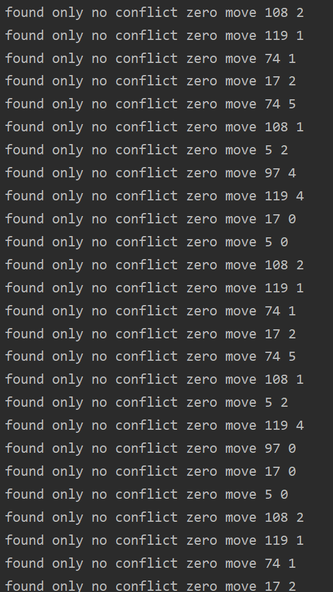

# TabuCol

## Introduction

A C++ OOP implementation of TabuCol Graph Coloring Algorithm which is the first application of Tabu Search to graph coloring.

## Literature

[1] Hertz, A., & de Werra, D. (1987). Using tabu search techniques for graph coloring. *Computing*, *39*(4), 345-351. 

## Implementation Abstraction

### Class

#### UndiGraph

- Store Graph with Adjacent List.
- Provide a public method to create graph from col file.

#### TabuCol

- Search Solution with a certain K——Number of Colors.
- Find Neighborhood solution and choose one with findMove method
- Apply the best move with makeMove method
- The iteration process stops when iteration time reaches maxIter

#### TabuCol2

- The improvement version of TabuCol using configuration checking

## Class Usage

```C++
#include "TabuCol.h"
#include "TabuCol2.h"

using std::cout;
using std::endl;
int main() {
    UndiGraph g;
    //create graph from col file
    int readResult=g.createFromCol("./data/DSJC500.5.col");
    if(readResult!=0){
    	cout<<"file read error"<<endl;
    	return 1;
	}
    //create tabucol algorithm, params : graph ,color num, maxIter
    TabuCol t(g, 49 ,100000000);
    t.tabuSearch();
    return 0;
}
```

1. Define UndiGraph object
2. Call createFromCol(), the only parameter is path to col file
3. Define TabuCol object with 3 parameters: Graph object, ColorNumK, Max iteration time
4. Call tabuSearch()


## Test Data


| Data Set  | Keys     | Program Result | Number of Iterations |
| --------- | -------- | -------------- | -------------------- |
| DSJC125.1 | 5        | 5              | 4103                 |
| DSJC125.5 | 17       | 17             | 87068                |
| DSJC125.9 | 44       | 44             | 11393                |
| DSJC250.1 | 8        | 8              | 22497                |
| DSJC250.5 | 28       | 28             | 9111442              |
| DSJC250.9 | 72       | 72             | 1815284              |
| DSJC500.1 | 12       | 12             | 105484402            |
| DSJC500.5 | 49,48,47 | 49             | 60805687             |


## Attempt for Improvement 

A new local search strategy called configuration checking (格局检测) has been proposed by Cai et al. and it can be applied in `TabuCol` algorithm for graph coloring problem.

In the `TabuCol2` class, the amendments are as follows:

1. The tabu policy is changed. `tabuTenure[vertex i]=color j` means `color j` is tabu for `vertex i` in the following moves. After making a move, the current move becomes tabu. The adjacent vertexes of current move vertex become non-tabu.
2. `groupVertexNum` array is used to store the number of vertexes in each group for Grouping Representation of solution, and the value can help to decide `ZERO_MOVE`.
3. `moveLastIter[i][j]=n` means the last `iter` is n when changing vertex i to color j. The smaller this value, the more likely the move is to be chosen.
4. `setRandMove()` method can set a random move to `nextMove` variable. `RANDOM_MOVE` can  jump out of local optimum.
5. `SNoise` controls the probability of accepting SECOND_BEST_MOVE. `LNoise` controls the probability of moving at random and skipping `ZERO_MOVE`.  `ZNoise` controls the probability of accepting one conflict zero move. `ZNoise` and `SNoise` are constant while `LNoise` is variable controlled by `nonNegativeDeltaIter`.
6. `nonNegativeDeltaIter` is the number of iterations that `deltaF >=0`. The larger `nonNegativeDeltaIter` the bigger `LNoise`, because we need to move at random when `f` can't become smaller.

### The Problem of This Tabu Strategy

In my experiment, some zero moves can cause a dead loop. As is shown in the following pictures.








This is because some vertexes are adjacent.  They'll unlock each other when making a ZERO_MOVE.

So my solution is to use `LNoise` to control the probability of skipping ZERO_MOVE. When `LNoise` becomes bigger due to `nonNegativeDeltaIter`, it is more likely to skip `ZERO_MOVE`. In this way we can jump out of the dead loop.

```C++
if(rand()%100<LNoise){
	skipZeroMove= true;
}
if(!skipZeroMove){
    return;
}
```
### The results

Green means better while red means worse.

| Data Set  | Keys     | Original Result | Original Iteration Number | Improvement Result | Improvement Iteration Number        |
| --------- | -------- | --------------- | ------------------------- | ------------------ | ----------------------------------- |
| DSJC125.1 | 5        | 5               | 4103                      | 5                  | <font color=red>25123</font>        |
| DSJC125.5 | 17       | 17              | 87068                     | 17                 | <font color=#008000>36243</font>    |
| DSJC125.9 | 44       | 44              | 11393                     | 44                 | <font color=#008000>1407</font>     |
| DSJC250.1 | 8        | 8               | 22497                     | 8                  | <font color=red>114294</font>       |
| DSJC250.5 | 28       | 28              | 9111442                   | 28                 | <font color=#008000>2736920</font>  |
| DSJC250.9 | 72       | 72              | 1815284                   | 72                 | <font color=#008000>290906</font>   |
| DSJC500.1 | 12       | 12              | 105484402                 | 12                 | <font color=#008000>23276968</font> |
| DSJC500.5 | 49,48,47 | 49              | 60805687                  | 49                 | <font color=#008000>26425482</font> |


## Summary

On datasets with less than 500 vertexes, the algorithm can output the result in acceptable time, while on datasets with equal or greater than 500 vertexes, it takes a long time to iterate.

The implement of the configuration checking improvement is not good enough.